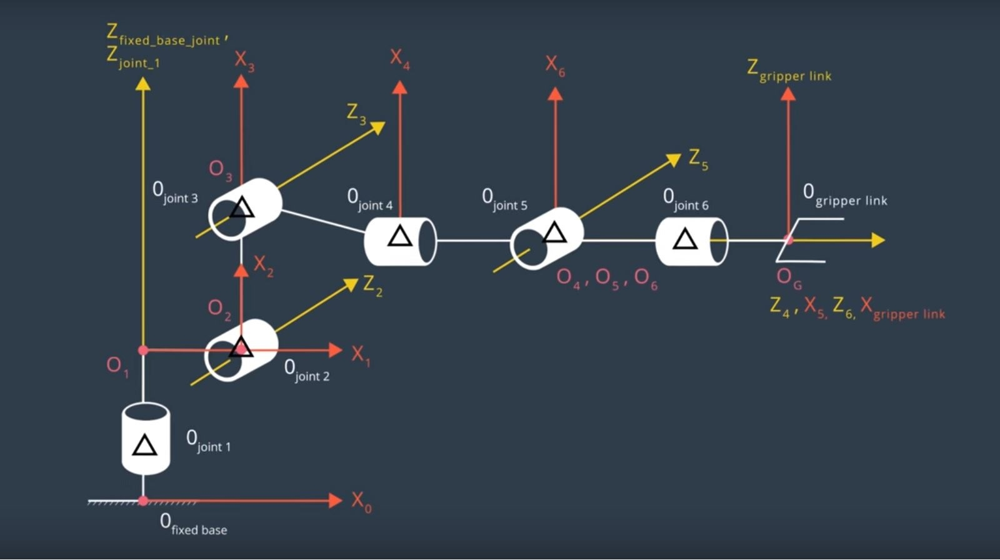
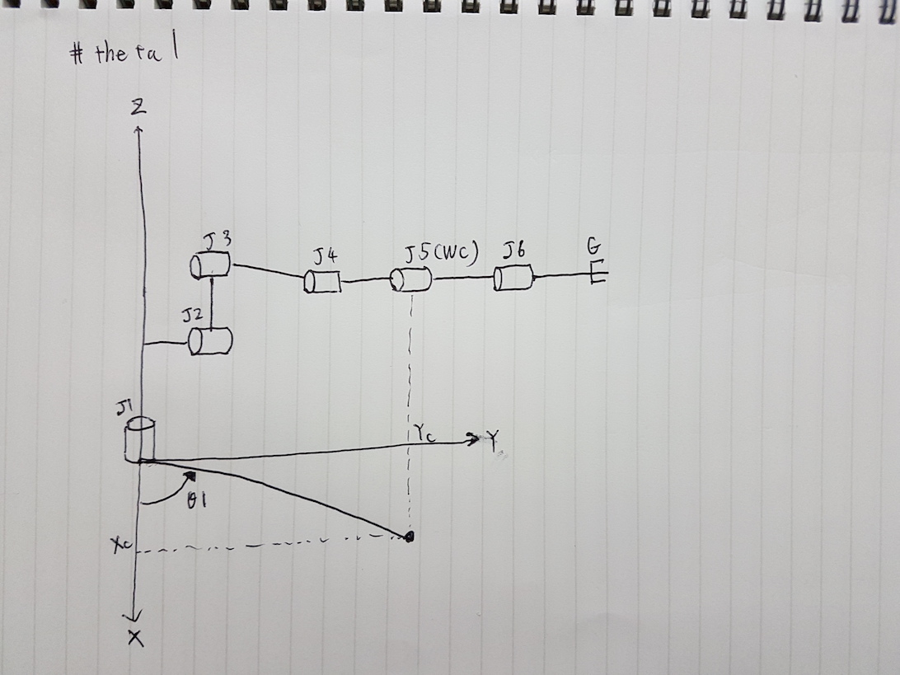
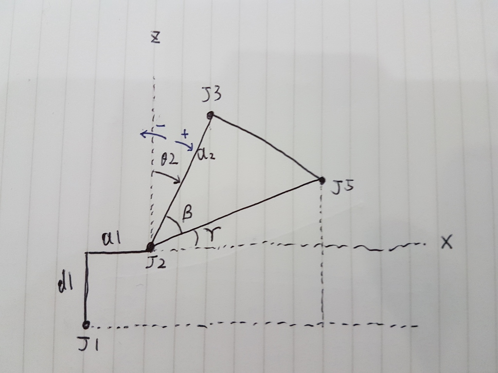
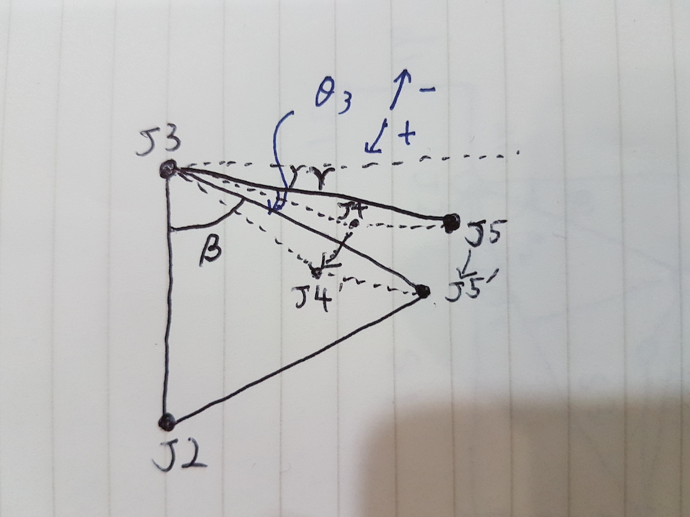
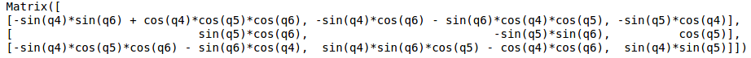
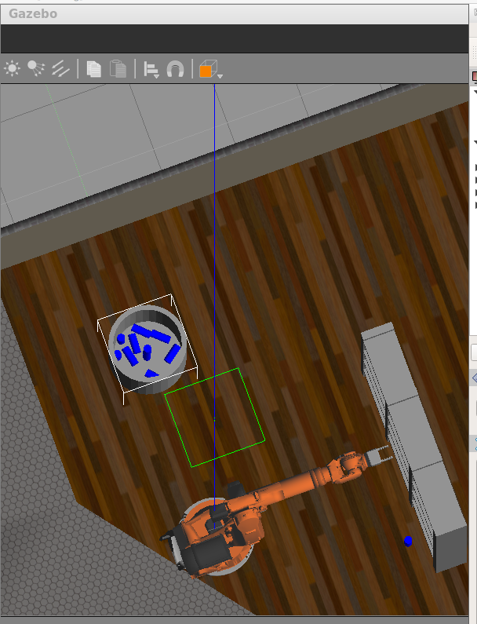

# Project: Kinematics Pick & Place
---
## Overview for this project

Apply inverse kinematics we learned through Udacity Robotics Nano degree program project 2 to calculate each joint rotation for KR210. Below describes the steps how to compute them.

---
#### 1. The DH parameters are deprived from the KR210 URDF file and refer to the default relative position of each joint below.



| Parameter   |  Explanation  | Value |
| -----       | -----         | ----- |
| alpha<sub>0</sub> | Z<sub>0</sub> Parallel to Z<sub>1</sub>        |  0 |
| alpha<sub>1</sub> | Z<sub>1</sub> Perpendicular to Z<sub>2</sub>        |  -90&deg; |
| alpha<sub>2</sub> | Z<sub>2</sub> Parallel to Z<sub>3</sub>        |  0 |
| alpha<sub>3</sub> | Z<sub>3</sub> Perpendicular to Z<sub>4</sub>        |  -90&deg; |
| alpha<sub>4</sub> | Z<sub>4</sub> Perpendicular to Z<sub>5</sub>        |  90&deg; |
| alpha<sub>5</sub> | Z<sub>5</sub> Perpendicular to Z<sub>6</sub>        |  -90&deg; |
| alpha<sub>6</sub> | Z<sub>6</sub> Parallel to Z<sub>7</sub>        |  0 |
| a<sub>0</sub>     | O<sub>1</sub> - O<sub>0</sub> along X<sub>1</sub>        | 0 |
| a<sub>1</sub>     | O<sub>2</sub> - O<sub>1</sub> along X<sub>2</sub>        | 0.75 |
| a<sub>2</sub>     | O<sub>3</sub> - O<sub>2</sub> along X<sub>3</sub>        | 2 - 0.75 = 1.25 |
| a<sub>3</sub>     | O<sub>4</sub> - O<sub>3</sub> along X<sub>4</sub>        | 1.946 - 2 = -0.054 |
| a<sub>4</sub>     | O<sub>5</sub> - O<sub>4</sub> along X<sub>5</sub>        | 0 |
| a<sub>5</sub>     | O<sub>6</sub> - O<sub>5</sub> along X<sub>6</sub>        | 0 |
| a<sub>6</sub>     | O<sub>7</sub> - O<sub>6</sub> along X<sub>7</sub>        | 0 |
| d<sub>1</sub>     | O<sub>1</sub> - O<sub>0</sub> along Z<sub>1</sub>        | 0.33 |
| d<sub>2</sub>     | O<sub>2</sub> - O<sub>1</sub> along Z<sub>2</sub>        | 0 |
| d<sub>3</sub>     | O<sub>3</sub> - O<sub>2</sub> along Z<sub>3</sub>        | 0 |
| d<sub>4</sub>     | O<sub>4</sub> - O<sub>3</sub> along Z<sub>4</sub>        | 1.85 - 0.35 = 1.50 |
| d<sub>5</sub>     | O<sub>5</sub> - O<sub>4</sub> along Z<sub>5</sub>        | 0 |
| d<sub>6</sub>     | O<sub>6</sub> - O<sub>5</sub> along Z<sub>6</sub>        | 0 |
| d<sub>7</sub>     | O<sub>7</sub> - O<sub>6</sub> along Z<sub>7</sub>        | 2.153 - 1.85 = 0.303 |
| theta<sub>1</sub> | X<sub>0</sub> Parallel to X<sub>1</sub>        |  theta<sub>1</sub> |
| theta<sub>2</sub> | X<sub>1</sub> Perpendicular to X<sub>2</sub>        |  theta<sub>2</sub> - 90&deg; |
| theta<sub>3</sub> | X<sub>2</sub> Parallel to X<sub>3</sub>        |  theta<sub>3</sub> |
| theta<sub>4</sub> | X<sub>3</sub> Parallel to X<sub>4</sub>        |  theta<sub>4</sub> |
| theta<sub>5</sub> | X<sub>4</sub> Parallel to X<sub>5</sub>        |  theta<sub>5</sub> |
| theta<sub>6</sub> | X<sub>5</sub> Parallel to X<sub>6</sub>        |  theta<sub>6</sub> |
| theta<sub>7</sub> | X<sub>6</sub> Parallel to X<sub>7</sub>        |  theta<sub>7</sub> |

#### 2. Using the DH parameter table derived earlier, create individual transformation matrices between each joint and generate a total homogeneous transform from base to gripper.

##### DH Parameter Table
```python
s = {alpha0:       0, a0:      0, d1:  0.75,
     alpha1: -pi / 2, a1:   0.35, d2:     0, q2: q2 - pi / 2,
     alpha2:       0, a2:   1.25, d3:     0,
     alpha3: -pi / 2, a3: -0.054, d4:   1.5,
     alpha4:  pi / 2, a4:      0, d5:     0,
     alpha5: -pi / 2, a5:      0, d6:     0,
     alpha6:       0, a6:      0, d7: 0.303, q7: 0}
```

##### Individual Transformation Matrices
```python
# base_link to link1
T0_1 = Matrix([[cos(q1), -sin(q1), 0, a0],
               [sin(q1) * cos(alpha0), cos(q1) * cos(alpha0), -sin(alpha0), -sin(alpha0) * d1],
               [sin(q1) * sin(alpha0), cos(q1) * sin(alpha0), cos(alpha0), cos(alpha0) * d1],
               [0, 0, 0, 1]])

# link1 to link2
T1_2 = Matrix([[cos(q2), -sin(q2), 0, a1],
               [sin(q2) * cos(alpha1), cos(q2) * cos(alpha1), -sin(alpha1), -sin(alpha1) * d2],
               [sin(q2) * sin(alpha1), cos(q2) * sin(alpha1), cos(alpha1), cos(alpha1) * d2],
               [0, 0, 0, 1]])

# link2 to link3
T2_3 = Matrix([[cos(q3), -sin(q3), 0, a2],
               [sin(q3) * cos(alpha2), cos(q3) * cos(alpha2), -sin(alpha2), -sin(alpha2) * d3],
               [sin(q3) * sin(alpha2), cos(q3) * sin(alpha2), cos(alpha2), cos(alpha2) * d3],
               [0, 0, 0, 1]])

# link3 to link4
T3_4 = Matrix([[cos(q4), -sin(q4), 0, a3],
               [sin(q4) * cos(alpha3), cos(q4) * cos(alpha3), -sin(alpha3), -sin(alpha3) * d4],
               [sin(q4) * sin(alpha3), cos(q4) * sin(alpha3), cos(alpha3), cos(alpha3) * d4],
               [0, 0, 0, 1]])

# link4 to link5
T4_5 = Matrix([[cos(q5), -sin(q5), 0, a4],
               [sin(q5) * cos(alpha4), cos(q5) * cos(alpha4), -sin(alpha4), -sin(alpha4) * d5],
               [sin(q5) * sin(alpha4), cos(q5) * sin(alpha4), cos(alpha4), cos(alpha4) * d5],
               [0, 0, 0, 1]])

# link5 to link6
T5_6 = Matrix([[cos(q6), -sin(q6), 0, a5],
               [sin(q6) * cos(alpha5), cos(q6) * cos(alpha5), -sin(alpha5), -sin(alpha5) * d6],
               [sin(q6) * sin(alpha5), cos(q6) * sin(alpha5), cos(alpha5), cos(alpha5) * d6],
               [0, 0, 0, 1]])

# link6 to gripper
T6_G = Matrix([[cos(q7), -sin(q7), 0, a6],
               [sin(q7) * cos(alpha6), cos(q7) * cos(alpha6), -sin(alpha6), -sin(alpha6) * d7],
               [sin(q7) * sin(alpha6), cos(q7) * sin(alpha6), cos(alpha6), cos(alpha6) * d7],
               [0, 0, 0, 1]])
```

##### A homogeneous transform matrix from base_link to gripper_link using only the position and orientation of the gripper_link
```python
T0_2 = simplify(T0_1 * T1_2)
T0_3 = simplify(T0_2 * T2_3)
T0_4 = simplify(T0_3 * T3_4)
T0_5 = simplify(T0_4 * T4_5)
T0_6 = simplify(T0_5 * T5_6)
T0_G = simplify(T0_6 * T6_7)

# URDF frame is different from our world frame so we need to apply a  
# correction rotation matrix in order to correct our transformation matrix.
R_z = Matrix([[cos(pi), -sin(pi), 0, 0],
              [sin(pi), cos(pi), 0, 0],
              [0, 0, 1, 0],
              [0, 0, 0, 1]])
R_y = Matrix([[cos(-pi / 2), 0, sin(-pi / 2), 0],
              [0, 1, 0, 0],
              [-sin(-pi / 2), 0, cos(-pi / 2), 0],
              [0, 0, 0, 1]])
R_corr = R_z * R_y
T_total = T0_G * R_corr
```

#### 3. Breakdown the IK problem into Position and Orientation problems. Derive the equations for individual joint angles. Here are the steps.

---
1. find the location of the WC relative to the base frame based on the following equation.


2. find joint variables, q1, q2 and q3 using given WC position.

3. once the first three joint variables are known, calculate
​R3_6 via application of homogeneous transforms up to the WC.

4. find a set of Euler angles corresponding to the rotation matrix.

---

###### 1 find the location of the WC relative to the base frame based on the equation.
```python
  # Extract end-effector position and orientation from request
  # px,py,pz = end-effector position
  # roll, pitch, yaw = end-effector orientation
  px = req.poses[x].position.x
  py = req.poses[x].position.y
  pz = req.poses[x].position.z

  (ee_roll, ee_pitch, ee_yaw) = tf.transformations.euler_from_quaternion(
                         [req.poses[x].orientation.x, req.poses[x].orientation.y,
                         req.poses[x].orientation.z, req.poses[x].orientation.w])

  # calculate total rotation between base_link and the gripper_link
  Ryaw = Matrix([[cos(yaw), -sin(yaw), 0, 0],
          		   [sin(yaw), cos(yaw), 0, 0],
          		   [0, 0, 1, 0],
                 [0, 0, 0, 1]])

  Rpitch = Matrix([[cos(pitch), 0, sin(pitch), 0],
    	             [0,1,0, 0],
    	             [-sin(pitch), 0, cos(pitch), 0],
                   [0, 0, 0, 1]])

  Rroll = Matrix([[1, 0, 0, 0],
    	            [0, cos(roll), -sin(roll), 0],
	                [0, sin(roll), cos(roll), 0],
                  [0, 0, 0, 1]])

  #equivalent to R0_6
  Rryp = (Ryaw * Rpitch * Rroll)

  # 1. Calculate Wrist Center(Joint 5 for our case)
  P_EE = Matrix([px, py, pz])
  D = Matrix([0, 0, s[d7]])
  P_WC = P_EE - Rrpy.evalf(subs={roll: ee_roll, pitch: ee_pitch, yaw: ee_yaw}) * D
  P_WC_x, P_WC_y, P_WC_z = P_WC[0], P_WC[1], P_WC[2]
```

##### 2. find joint variables, q1, q2 and q3 using given WC position.

For theta1 calculation


```python
  # 2. calculate theta1
  # Simply project the coordinate of the WC into the ground plane refer to the figure 3 in RoboND-P2.md
  theta1 = atan2(P_WC_y, P_WC_x).evalf()
```
For theta2 calculation


```python
  # 3. calculate theta2
  # dist_J2xy_5xy: distance between the x-y-plane projections of joint2 and joint5(WC)
  # dist_j2z_5z: distance between the z-plane projections of joint2 and joint5(WC)
  # dist_J2_5: distance between joint2 and joint5
  # dist_J3_5: distance between joint3 and joint5
  # ganma: the angle consisted of dist_J2xy_5xy and dist_j2z_5z
  # beta: the angle consisted of dist_J3_5 and dist_J2_5

  dist_J2xy_5xy = sqrt(P_WC_x**2 + P_WC_y**2) - s[a1]
  dist_j2z_5z = P_WC_z - s[d1]
  dist_J2_5 = sqrt(dist_J2xy_5xy**2 + dist_j2z_5z**2)
  dist_J3_5 = sqrt(s[d4]**2 + s[a3]**2)
  ganma = atan2(dist_j2z_5z, dist_J2xy_5xy)
  cos_beta = (s[a2]**2 + dist_J2_5**2 - dist_J3_5**2)/(2*s[a2]*dist_J2_5) # Law of cos
  sin_beta = sqrt(1-cos_beta**2)
  beta = atan2(sin_beta, cos_beta)

  theta2 = (pi/2 - ganma - beta).evalf()
```
For theta3 calculation


```python
  # 4. calculate theta3
  #law of cosine: i.e. a**2 = b**2 + c**2 - 2bc * cos
  delta = acos((J2_5**2 - J2_3**2 - J3_5**2)/(-2*J2_3*J3_5))
  epsilon = asin(J3_4_offset/J3_5)
  theta3 = np.pi/2 - delta - epsilon
```
##### 3 & 4 once the first three joint variables are known, calculate R3_6 via application of homogeneous transforms up to the WC and find a set of Euler angles corresponding to the rotation matrix.(Refer to lesson 2-8)

```python
  T0_3 = T0_1 * T1_2 * T2_3
  R0_3 = T0_3[0:3, 0:3]
  # Tried inv("LU") but gave outside of joint range
  # So I stick to normal inverse
  R3_6 = (R0_3 ** (-1)) * Rrpy
```
Through above calculation, we can get following representation:


Then the rest three theta can be found in the following way.
For multiple solution issue on theta4 and theta6 depending on theta5, I added if statement as advised so that atan2 can always return a result in one of two possible quadrant(i.e. if there is case both quadrant1 and quadrant3 applicable, always return a value in quadrant1). 

```python

  # 5. calculate theta4, 5, 6 following the way Lesson 2 - 8:
  R3_6_num = R3_6.evalf(subs={q1: theta1, q2: theta2, q3: theta3, roll: ee_roll, pitch: ee_pitch, yaw: ee_yaw})

  r13 = R3_6_num[0,2]
  r33 = R3_6_num[2,2]

  r21 = R3_6_num[1,0]
  r22 = R3_6_num[1,1]

  r23 = R3_6_num[1,2]

  theta5 = atan2(sqrt(1 - r23**2), r23).evalf()
  if sin(theta5) < 0:
  	theta4 = atan2(-r33, r13).evalf()
  	theta6 = atan2(r22, -r21).evalf()
  else:
  	theta4 = atan2(r33, -r13).evalf()
  	theta6 = atan2(-r22, r21).evalf()

  theta4 = atan2(r33, -r13).evalf()
  theta5 = atan2(sqrt(1 - r23**2), r23).evalf()
  theta6 = atan2(-r22, r21).evalf()
```
#### 4 Result
Achieved 9 success out of 10 trials!

